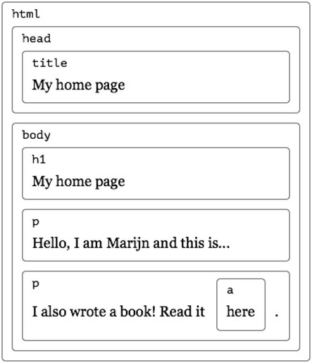
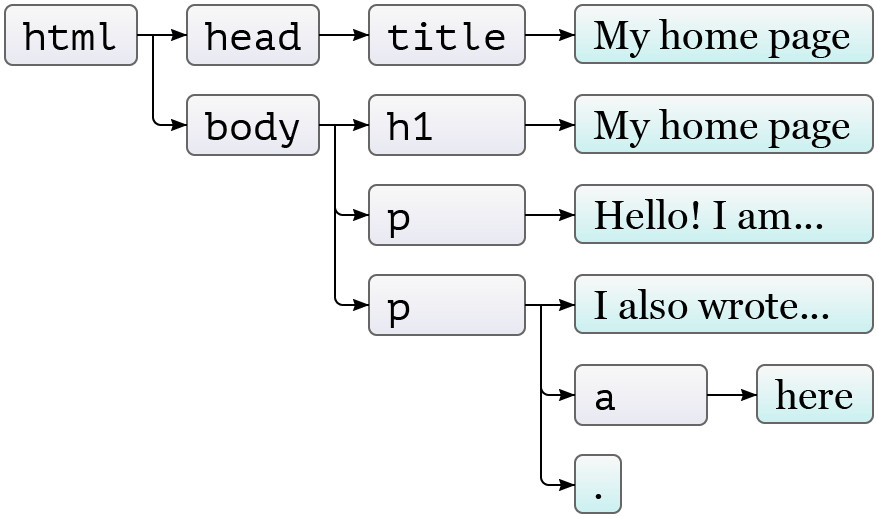
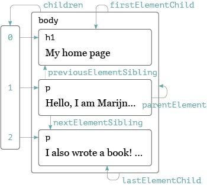

<!--
_class: invert lead
_paginate: false
_footer: ""
-->

# WEB230: JavaScript 1

## Module 5: The Document Object Model

---

# Document Object Model (DOM)

-  browser downloads the HTML text file
-  parses it
-  builds a model of the document structure
-  uses it to draw on the screen
-  we can modify this model from JavaScript

---

# Document Structure

```html
<!DOCTYPE html>
<html>
   <head>
      <title>My home page</title>
   </head>
   <body>
      <h1>My home page</h1>
      <p>Hello, I am Marijn and this is my home page.</p>
      <p>
         I also wrote a book! Read it
         <a href="http://eloquentjavascript.net">here</a>.
      </p>
   </body>
</html>
```

---

# Document Structure



---

# DOM Structure

-  the DOM follows the same structure
-  objects inside of objects, inside of objects
-  we can interact with these objects to:
   -  get information
   -  add or change information
   -  add events
-  global variable `document` contains the DOM

---

# Trees

-  this data structure is called a **tree**
-  there are nodes for elements
   -  represent HTML tags
   -  determine the structure
-  can have children
   -  other elements
   -  leaf nodes such as text content, comments, etc.

---

# Trees (continued)

-  each node object has a `nodeType`
   -  elements nodes are `1`
   -  JS has constants such as `document.ELEMENT_NODE` to make this easier

---

# Trees (continued)



---

# Finding Elements

-  we can find element directly
-  `document.getElementsByTagName("a")`
-  `document.getElementsByClassName("selected")`
   -  these return an array like object called an HTMLCollection
-  `document.getElementById("gertrude")`
   -  returns a single element

---

# Finding Elements - New Way

-  new methods in JavaScript (IE9+) make selecting elements even easier
-  use CSS selectors to select elements
-  with these two, you don't need any of the previous methods

   -  `document.querySelector()` - returns the first matching element
   -  `document.querySelectorAll()` - returns an array like object, a NodeList, of all matching elements

---

# Static vs Live

-  some methods return live lists that will update if the DOM changes
-  `.getElementsByTagName()` and `.getElementsByClassName()` return a live list
   -  it will be updated if the DOM changes
-  `.querySelectorAll()` returns a static list
   -  it will not change as elements are added or removed

---

## Converting to an Array

-  `Array.from()` is a new method for making an array from an array like object
   -  not supported in Internet Explorer
-  Simplest form, just takes one argument:

```javascript
let arrayish = { 0: 'one', 1: 'two', length: 2 };
let array = Array.from(arrayish);
```

---

# Moving Through the Tree

-  nodes have properties for moving around the tree



---

These are different than the textbook but only select elements, skipping other nodes.

-  `.children`
-  `.firstElementChild`
-  `.lastElementChild`
-  `.nextElementSibling`
-  `.previousElementSibling`
-  `.parentElement`

---

# Changing the Document

-  almost everything in the DOM can be changed
-  some methods:
   -  `.remove()`
   -  `.replaceWith()`
   -  `.appendChild()`
   -  `.insertBefore()`

---

# Working with Content

To make it easier to work with the content of elements we have two properties:

-  `.textContent` - only gets or sets text content of the element
-  `.innerHTML` - contained elements are represented as tags

---

# Creating Nodes

-  can create new text and element nodes
   -  `document.createElement()`
   -  `document.createTextNode()`

---

# Attributes

-  most common attributes can be accessed as properties of the DOM element
   -  eg. `href` is `.href`, `id` is `.id`
-  others accessed through methods:
   -  `getAttribute()`
   -  `setAttribute()`
-  if you create your own attributes, prefix with `data-`

---

# `class` Attribute

-  `class` is a reserved word in JavaScript
-  use the property name `className` instead
-  browsers also have an array like property `classList`
   -  has methods for dealing with classes `.add()`, `.remove()`, `.toggle()`, `.contains()`

---

# Styling

-  `style` property contains properties for every possible style

```javascript
const para = document.getElementById('para');
console.log(para.style.color);
para.style.color = 'magenta';
```

-  some style names contain dashes
-  use camel case instead:
-  `font-family` becomes `fontFamily`

---

# Cascading Styles

-  the `style` property applies directly to the element
-  it has the highest precedence
-  will over-rule stylesheets or inherited styles

---

# Summary

-  JavaScript programs can inspect and change the page
-  the data structure of the page is called the DOM and is accessed by the variable `document`
-  the DOM is organized like a tree
-  we can select, read, and modify element and text in the DOM
-  styles can influence the way elements are displayed

---

<!--
_class: lead
_footer: ""
_paginate: false
-->

# ☀
